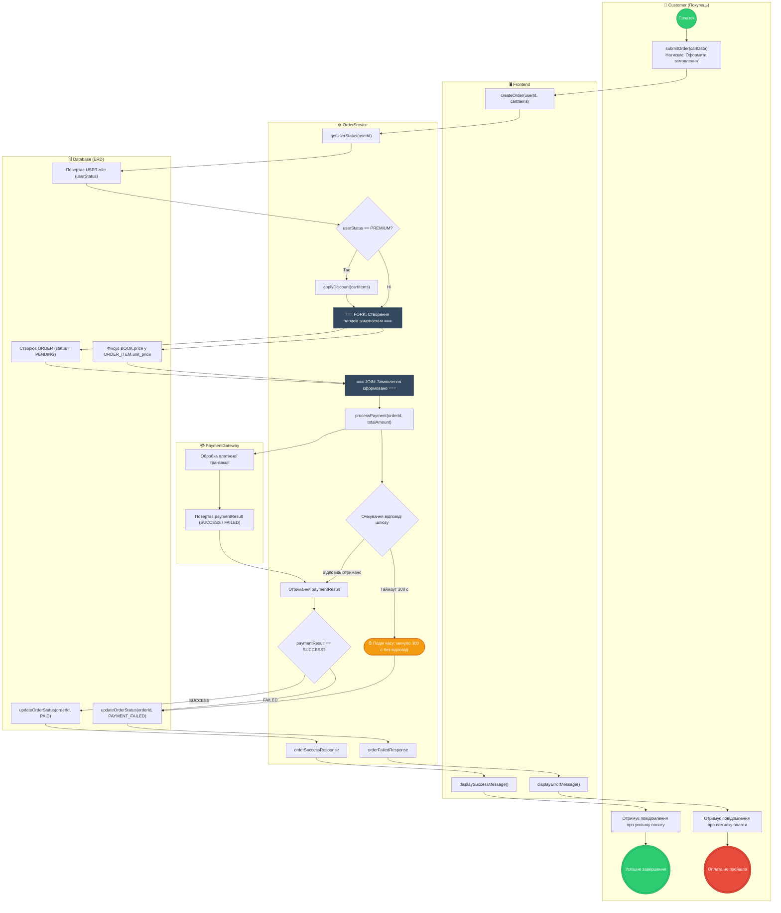

```mermaid
flowchart TD
    %% --- Доріжка Customer ---
    subgraph Customer ["👤 Customer (Покупець)"]
        Start((Початок))
        Act_Submit["submitOrder(cartData)<br/>Натискає 'Оформити замовлення'"]
        Act_ShowSuccess["Отримує повідомлення про успішну оплату"]
        Act_ShowError["Отримує повідомлення про помилку оплати"]
        EndSuccess(((Успішне завершення)))
        EndFailed(((Оплата не пройшла)))
    end

    %% --- Доріжка Frontend ---
    subgraph Frontend ["🖥️ Frontend"]
        Act_SendCreate["createOrder(userId, cartItems)"]
        Act_DisplaySuccess["displaySuccessMessage()"]
        Act_DisplayError["displayErrorMessage()"]
    end

    %% --- Доріжка OrderService ---
    subgraph OrderService ["⚙️ OrderService"]
        Act_ReqUser["getUserStatus(userId)"]
        Cond_Premium{"userStatus == PREMIUM?"}
        Act_Discount["applyDiscount(cartItems)"]
        Fork1["=== FORK: Створення записів замовлення ==="]
        Join1["=== JOIN: Замовлення сформовано ==="]
        Act_CallPay["processPayment(orderId, totalAmount)"]
        Wait_Pay{"Очікування відповіді шлюзу"}
        Event_Timeout(["⏱ Подія часу: минуло 300 с без відповіді"])
        Act_RecvPay["Отримання paymentResult"]
        Cond_Pay{"paymentResult == SUCCESS?"}
        Act_SendSuccess["orderSuccessResponse"]
        Act_SendError["orderFailedResponse"]
    end

    %% --- Доріжка Database ---
    subgraph Database ["🗄️ Database (ERD)"]
        Act_GetUser["Повертає USER.role (userStatus)"]
        Act_CreateOrder["Створює ORDER (status = PENDING)"]
        Act_FixPrice["Фіксує BOOK.price у ORDER_ITEM.unit_price"]
        Act_SetPaid["updateOrderStatus(orderId, PAID)"]
        Act_SetFailed["updateOrderStatus(orderId, PAYMENT_FAILED)"]
    end

    %% --- Доріжка PaymentGateway ---
    subgraph PaymentGateway ["💳 PaymentGateway"]
        Act_ProcessPay["Обробка платіжної транзакції"]
        Act_ReturnPay["Повертає paymentResult (SUCCESS / FAILED)"]
    end

    %% --- Потік процесу ---
    Start --> Act_Submit
    Act_Submit --> Act_SendCreate
    Act_SendCreate --> Act_ReqUser
    Act_ReqUser --> Act_GetUser
    Act_GetUser --> Cond_Premium

    Cond_Premium -- Так --> Act_Discount
    Act_Discount --> Fork1
    Cond_Premium -- Ні --> Fork1

    %% Паралельне створення ORDER та ORDER_ITEM (REQ-2)
    Fork1 --> Act_CreateOrder
    Fork1 --> Act_FixPrice
    Act_CreateOrder --> Join1
    Act_FixPrice --> Join1

    %% Виклик оплати та очікування / таймаут
    Join1 --> Act_CallPay
    Act_CallPay --> Act_ProcessPay
    Act_CallPay --> Wait_Pay

    Act_ProcessPay --> Act_ReturnPay
    Act_ReturnPay --> Act_RecvPay

    Wait_Pay -- Відповідь отримано --> Act_RecvPay
    Wait_Pay -- Таймаут 300 с --> Event_Timeout

    Act_RecvPay --> Cond_Pay

    %% Успішна оплата
    Cond_Pay -- SUCCESS --> Act_SetPaid
    Act_SetPaid --> Act_SendSuccess
    Act_SendSuccess --> Act_DisplaySuccess
    Act_DisplaySuccess --> Act_ShowSuccess
    Act_ShowSuccess --> EndSuccess

    %% Помилка оплати або таймаут
    Cond_Pay -- FAILED --> Act_SetFailed
    Event_Timeout --> Act_SetFailed
    Act_SetFailed --> Act_SendError
    Act_SendError --> Act_DisplayError
    Act_DisplayError --> Act_ShowError
    Act_ShowError --> EndFailed

    %% --- Стилізація ---
    style Start fill:#2ecc71,stroke:#27ae60,stroke-width:2px,color:#fff
    style EndSuccess fill:#2ecc71,stroke:#27ae60,stroke-width:2px,color:#fff
    style EndFailed fill:#e74c3c,stroke:#c0392b,stroke-width:2px,color:#fff
    style Fork1 fill:#34495e,stroke:#2c3e50,color:#fff
    style Join1 fill:#34495e,stroke:#2c3e50,color:#fff
    style Event_Timeout fill:#f39c12,stroke:#d35400,color:#fff
```