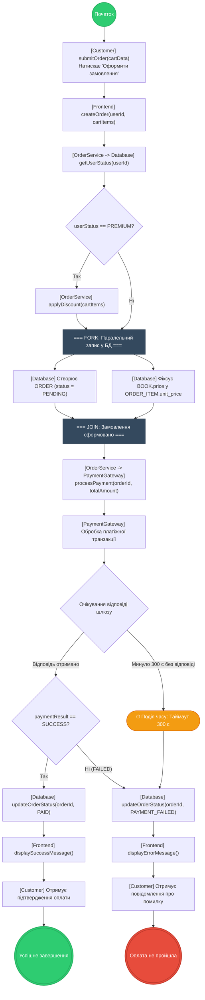

# Оформлення та оплата замовлення 

```mermaid
flowchart TD
    Start((Початок)) --> Act_Submit["[Customer] submitOrder(cartData)<br/>Натискає 'Оформити замовлення'"]
    Act_Submit --> Act_SendCreate["[Frontend] createOrder(userId, cartItems)"]
    Act_SendCreate --> Act_GetUser["[OrderService -> Database] getUserStatus(userId)"]
    Act_GetUser --> Cond_Premium{"userStatus == PREMIUM?"}

    Cond_Premium -- Так --> Act_Discount["[OrderService] applyDiscount(cartItems)"]
    Act_Discount --> Fork1["=== FORK: Паралельний запис у БД ==="]
    Cond_Premium -- Ні --> Fork1

    Fork1 --> Act_CreateOrder["[Database] Створює ORDER (status = PENDING)"]
    Fork1 --> Act_FixPrice["[Database] Фіксує BOOK.price у ORDER_ITEM.unit_price"]

    Act_CreateOrder --> Join1["=== JOIN: Замовлення сформовано ==="]
    Act_FixPrice --> Join1

    Join1 --> Act_CallPay["[OrderService -> PaymentGateway]<br/>processPayment(orderId, totalAmount)"]
    Act_CallPay --> Act_ProcessPay["[PaymentGateway] Обробка платіжної транзакції"]
    Act_ProcessPay --> Wait_Pay{"Очікування відповіді шлюзу"}

    Wait_Pay -- Відповідь отримано --> Cond_Pay{"paymentResult == SUCCESS?"}
    Wait_Pay -- Минуло 300 с без відповіді --> Event_Timeout(["⏱ Подія часу: Таймаут 300 с"])

    %% Гілка успішної оплати
    Cond_Pay -- Так --> Act_SetPaid["[Database] updateOrderStatus(orderId, PAID)"]
    Act_SetPaid --> Act_DisplaySuccess["[Frontend] displaySuccessMessage()"]
    Act_DisplaySuccess --> Act_ShowSuccess["[Customer] Отримує підтвердження оплати"]
    Act_ShowSuccess --> EndSuccess(((Успішне завершення)))

    %% Гілка помилки або таймауту
    Cond_Pay -- Ні (FAILED) --> Act_SetFailed["[Database] updateOrderStatus(orderId, PAYMENT_FAILED)"]
    Event_Timeout --> Act_SetFailed
    Act_SetFailed --> Act_DisplayError["[Frontend] displayErrorMessage()"]
    Act_DisplayError --> Act_ShowError["[Customer] Отримує повідомлення про помилку"]
    Act_ShowError --> EndFailed(((Оплата не пройшла)))

    %% --- Стилізація ---
    style Start fill:#2ecc71,stroke:#27ae60,stroke-width:2px,color:#fff
    style EndSuccess fill:#2ecc71,stroke:#27ae60,stroke-width:2px,color:#fff
    style EndFailed fill:#e74c3c,stroke:#c0392b,stroke-width:2px,color:#fff
    style Fork1 fill:#34495e,stroke:#2c3e50,color:#fff
    style Join1 fill:#34495e,stroke:#2c3e50,color:#fff
    style Event_Timeout fill:#f39c12,stroke:#d35400,color:#fff
```