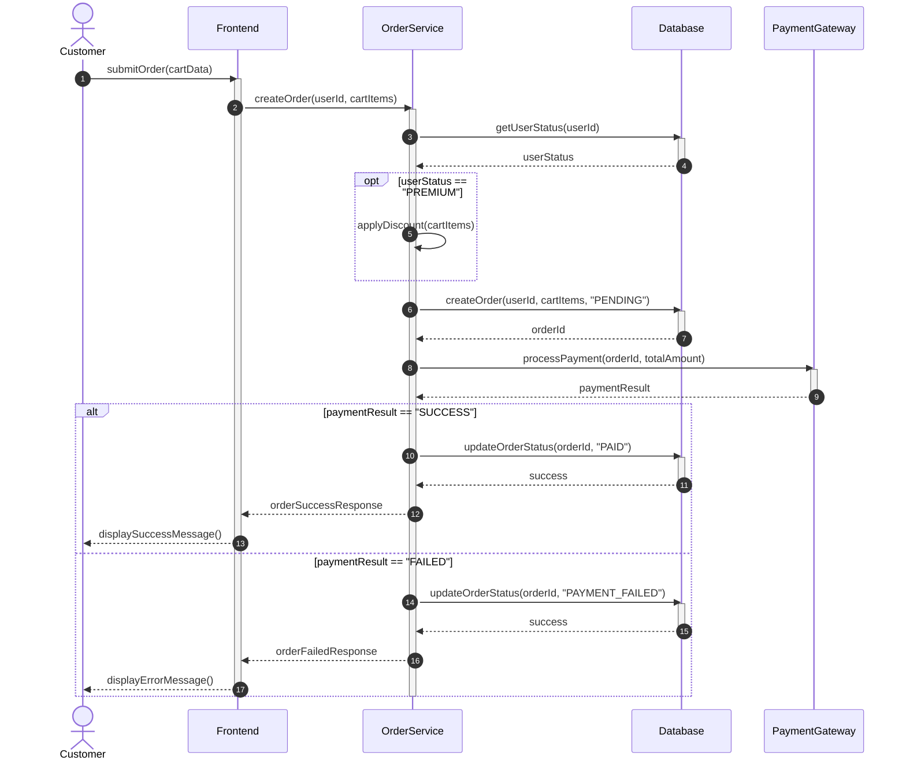
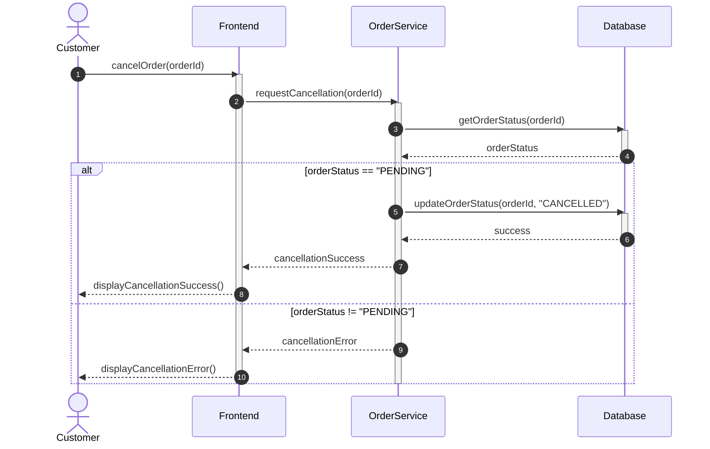
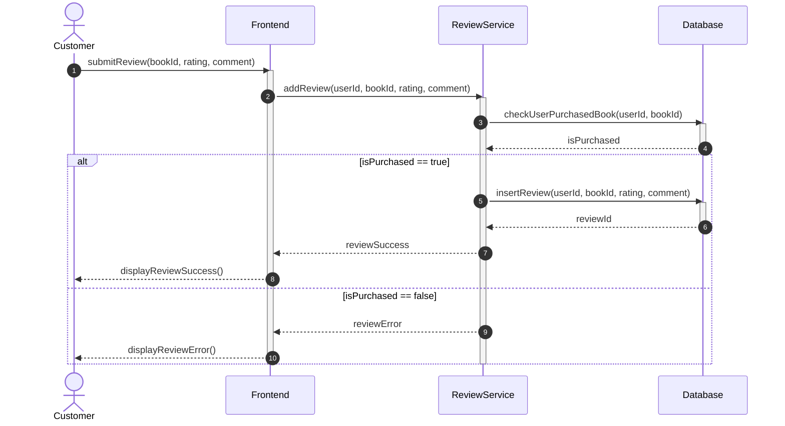

# Sequence Diagrams

## Сценарій 1: Оформлення та оплата

```mermaid
sequenceDiagram
    autonumber
    actor Customer
    participant Frontend
    participant OrderService
    participant Database
    participant PaymentGateway

    Customer->>Frontend: submitOrder(cartData)
    activate Frontend
    Frontend->>OrderService: createOrder(userId, cartItems)
    activate OrderService

    OrderService->>Database: getUserStatus(userId)
    activate Database
    Database-->>OrderService: userStatus
    deactivate Database

    opt userStatus == "PREMIUM"
        OrderService->>OrderService: applyDiscount(cartItems)
    end

    OrderService->>Database: createOrder(userId, cartItems, "PENDING")
    activate Database
    Database-->>OrderService: orderId
    deactivate Database

    OrderService->>PaymentGateway: processPayment(orderId, totalAmount)
    activate PaymentGateway
    PaymentGateway-->>OrderService: paymentResult
    deactivate PaymentGateway

    alt paymentResult == "SUCCESS"
        OrderService->>Database: updateOrderStatus(orderId, "PAID")
        activate Database
        Database-->>OrderService: success
        deactivate Database
        OrderService-->>Frontend: orderSuccessResponse
        Frontend-->>Customer: displaySuccessMessage()
    else paymentResult == "FAILED"
        OrderService->>Database: updateOrderStatus(orderId, "PAYMENT_FAILED")
        activate Database
        Database-->>OrderService: success
        deactivate Database
        OrderService-->>Frontend: orderFailedResponse
        Frontend-->>Customer: displayErrorMessage()
    end

    deactivate OrderService
    deactivate Frontend
```

---

## Сценарій 2: Скасування замовлення

```mermaid
sequenceDiagram
    autonumber
    actor Customer
    participant Frontend
    participant OrderService
    participant Database

    Customer->>Frontend: cancelOrder(orderId)
    activate Frontend
    Frontend->>OrderService: requestCancellation(orderId)
    activate OrderService

    OrderService->>Database: getOrderStatus(orderId)
    activate Database
    Database-->>OrderService: orderStatus
    deactivate Database

    alt orderStatus == "PENDING"
        OrderService->>Database: updateOrderStatus(orderId, "CANCELLED")
        activate Database
        Database-->>OrderService: success
        deactivate Database
        OrderService-->>Frontend: cancellationSuccess
        Frontend-->>Customer: displayCancellationSuccess()
    else orderStatus != "PENDING"
        OrderService-->>Frontend: cancellationError
        Frontend-->>Customer: displayCancellationError()
    end

    deactivate OrderService
    deactivate Frontend
```

---

## Сценарій 3: Додавання відгуку

```mermaid
sequenceDiagram
    autonumber
    actor Customer
    participant Frontend
    participant ReviewService
    participant Database

    Customer->>Frontend: submitReview(bookId, rating, comment)
    activate Frontend
    Frontend->>ReviewService: addReview(userId, bookId, rating, comment)
    activate ReviewService

    ReviewService->>Database: checkUserPurchasedBook(userId, bookId)
    activate Database
    Database-->>ReviewService: isPurchased
    deactivate Database

    alt isPurchased == true
        ReviewService->>Database: insertReview(userId, bookId, rating, comment)
        activate Database
        Database-->>ReviewService: reviewId
        deactivate Database
        ReviewService-->>Frontend: reviewSuccess
        Frontend-->>Customer: displayReviewSuccess()
    else isPurchased == false
        ReviewService-->>Frontend: reviewError
        Frontend-->>Customer: displayReviewError()
    end

    deactivate ReviewService
    deactivate Frontend
```